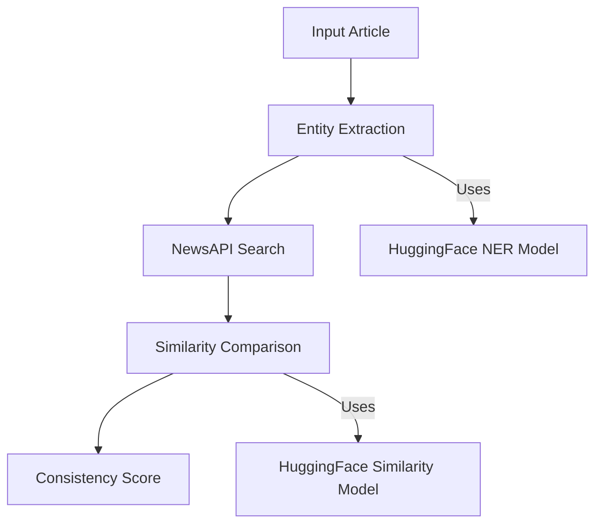

<div align="center">
  <picture>
    <source srcset="https://github.com/user-attachments/assets/3afe6814-2a4d-4d61-b487-e2065e6d9daf" media="(prefers-color-scheme: dark)">
    
  </picture>
</div>

---

A .NET Core backend service that analyzes articles using NLP techniques to extract entities and find similar articles for corroboration. **⚠️ STILL UNDER DEVELOPMENT**

## Setup

1. Clone the repository
2. Add API keys to [appsettings.json](appsettings.json):
```json
{
  "HuggingFace": {
    "ApiKey": "your-huggingface-api-key"
  },
  "NewsApi": {
    "ApiKey": "your-newsapi-key"
  }
}
```
3. Install dependencies and run:
```bash
dotnet restore
dotnet run
```
4. Access Swagger UI at `http://localhost:5250/swagger`

## How It Works (to be finished)

The service provides a single endpoint `/api/nlp/corroborate` that:
1. Accepts article content and title
2. Extracts named entities (people, organizations, locations)
3. Searches for similar articles
4. Calculates consistency score

## NLP Pipeline



### NLP Components

1. **Named Entity Recognition (NER)**
   - Uses `dslim/bert-base-NER` model
   - Extracts people, organizations, locations
   - Filters entities with >60% confidence

2. **Article Search**
   - Uses NewsAPI to find related articles
   - Queries built from extracted entities
   - Returns top 5 most relevant articles

3. **Similarity Scoring**
   - Uses `sentence-transformers/all-MiniLM-L6-v2` model
   - Compares original article with found articles
   - Generates consistency score based on similarities

### Example Request

```http
POST /api/nlp/corroborate
Content-Type: application/json

{
  "content": "Tesla CEO Elon Musk announced...",
  "title": "Tesla Announces New Factory"
}
```

The service returns extracted entities, similar articles, and a consistency score to help verify article authenticity.
```

This provides a clear overview of your project's setup, architecture, and NLP functionality. The mermaid diagram shows the data flow through the system's components.This provides a clear overview of your project's setup, architecture, and NLP functionality. The mermaid diagram shows the data flow through the system's components.
